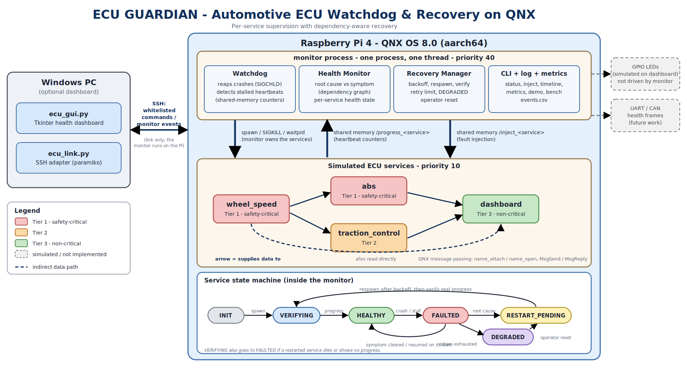
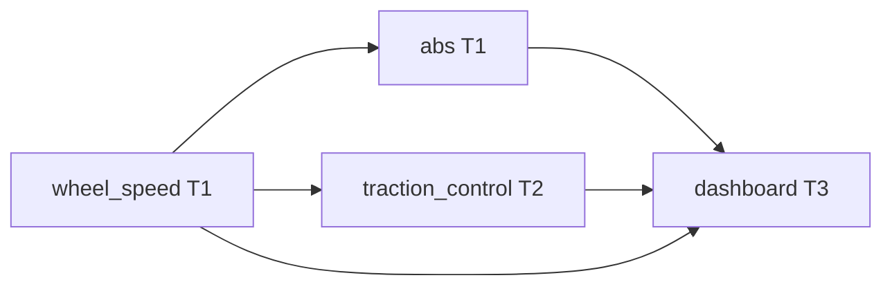
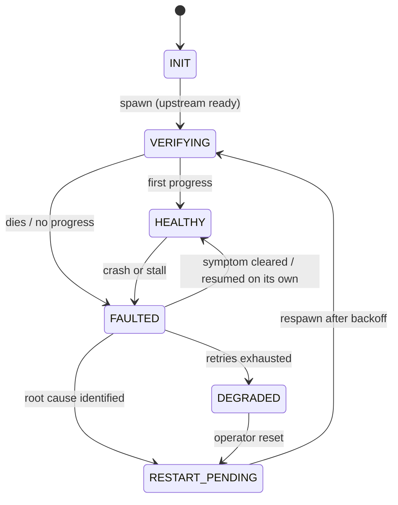

# ECU GUARDIAN — Automotive ECU Watchdog & Recovery Framework

A supervisory framework for **QNX OS 8.0 on Raspberry Pi 4** that monitors several simulated automotive ECU services, detects crashes, hangs, deadlock-style stalls and execution overruns, and **recovers only the failed service** (never the whole system). It ships with a mandatory CLI and an optional Python health dashboard.

> Problem statement 7 — *Automotive ECU Watchdog & Recovery Framework*: detect software failures and recover individual ECU services without rebooting the entire system.
---

## 1. What it does

- Starts and supervises four simulated ECU services that depend on each other.
- Detects failures in two ways:
  - **Crash** — the monitor is the parent of every service and learns about a death immediately (`SIGCHLD` + `waitpid`).
  - **Hang / missed heartbeat** — every service increments a progress counter in shared memory; a counter that stops moving is a stall.
- Separates the **root cause** from its **symptoms** using the service dependency graph. If `wheel_speed` fails, `abs`, `traction_control` and `dashboard` stall too, but only `wheel_speed` is restarted.
- Restarts safely: kill, reap, wait out a backoff, respawn only when upstream services are up, then **verify real progress** before declaring recovery.
- Bounds retries. When a service keeps failing it is moved to `DEGRADED` (no more restarts), a safe-state action is logged and its dependents are marked unavailable.
- Records a failure timeline and recovery metrics, available from the CLI, `events.csv` and the GUI.
- Includes built-in **fault injection** (crash, stuck, overrun, deadlock) and a scripted `demo` / random `bench` mode for repeatable evidence.

---

## 2. Architecture



### Services (simulated ECUs)

| Service | Tier | Role | Depends on |
|---|---|---|---|
| `wheel_speed` | 1 (safety-critical) | Produces a simulated wheel speed; idle heartbeat every 500 ms | — |
| `abs` | 1 (safety-critical) | Computes the braking decision | `wheel_speed` |
| `traction_control` | 2 | Computes the traction decision | `wheel_speed` |
| `dashboard` | 3 (non-critical) | Polls all three and displays status | `abs`, `traction_control`, `wheel_speed` |



### How the problem-statement roles map to the code

The problem statement lists a Watchdog, a Health Monitor and a Recovery Manager. They are separate **logical components inside one monitor process**:

| Role | Where in `monitor.c` |
|---|---|
| Watchdog | `reap_children()`, `detect()` — process death and stalled progress counters |
| Health Monitor | `isolate_and_recover()` — root cause vs. symptom decision, per-service health state |
| Recovery Manager | `drive_spawns()`, `reset_service()`, `degrade()` — backoff, respawn, verification, escalation |

### Per-service state machine



All timing is non-blocking: one loop ticks every 100 ms and is woken early by `SIGCHLD`, so the watchdog never goes blind while a recovery is in progress.

---

## 3. QNX concepts used

| QNX feature | Use in this project |
|---|---|
| Microkernel message passing (`MsgSend` / `MsgReceive` / `MsgReply`) | All service-to-service communication |
| Name resolution (`name_attach` / `name_open`) | Services find each other by name and reconnect after a restart |
| POSIX shared memory (`shm_open` / `mmap`) | Heartbeat counters and fault-injection commands |
| Process control (`spawnl`, `waitpid`, signals) | The monitor owns, kills, reaps and restarts services |
| Priority scheduling (`sched_setparam`) | Monitor at priority 40, services at priority 10 |
| Timed receive (`TimerTimeout`) | `wheel_speed` wakes every 500 ms to show liveness even when idle |
| Threads and mutexes | `abs` and `traction_control` use a worker thread plus a serving thread sharing a mutex |

---

## 4. Recovery policy

| Service | Stall limit | Max retries | Verify window | Recovery budget |
|---|---|---|---|---|
| `wheel_speed` | 5000 ms | 3 | 8000 ms | 3000 ms |
| `abs` | 5000 ms | 3 | 8000 ms | 3000 ms |
| `traction_control` | 5000 ms | 3 | 8000 ms | 5000 ms |
| `dashboard` | 5000 ms | 2 | 8000 ms | 8000 ms |

- **Backoff** between restart attempts: 100, 500, 1500, then 3000 ms. This gives the old process time to release its name and stops a crash loop from burning the retry budget in milliseconds.
- **Flap guard:** the retry counter resets only after 20 s of continuous health, so a service that fails repeatedly ends up `DEGRADED` instead of being restarted forever.
- **Restart order:** by tier (most critical first). A service is only spawned when the services it depends on are up.
- **Escalation:** `DEGRADED` kills the service, stops restarting it, logs a tier-specific `SAFE_STATE` message and marks its dependents `DEGRADED` (`DEPENDENCY_LOST`). The operator re-arms with `reset`.
- **Execution overrun:** a progress gap above 4000 ms but below the stall limit is logged as `OVERRUN` (no restart). A gap at or above the stall limit is handled as a hang.

---

## 5. Fault injection

Faults are injected through a shared-memory object per service. A service notices the command at the top of its work loop (up to about 3 s later, because the service loops run every 2–3 s).

| Fault | What the service does |
|---|---|
| `crash` | Calls `abort()` |
| `stuck` | Stays alive but stops making progress |
| `overrun` | Blocks one cycle for N ms (default 6000) |
| `deadlock` | The worker takes its mutex and never releases it, so the service stops answering clients. In services without a mutex it behaves as `stuck`. This is a lock-hold hang, not a textbook circular deadlock. |
| `clear` | Cancels a pending or persistent fault |

Add `persist` to make a fault return after every restart, which drives a service into `DEGRADED`.

---

## 6. Repository layout

```
abs/               abs service (QNX project)
dashboard/         dashboard service
traction_control/  traction_control service
wheel_speed/       wheel_speed service
monitor/           watchdog + health monitor + recovery manager + CLI
gui/               ecu_gui.py (Tkinter dashboard), ecu_link.py (SSH adapter), test_link.py
common.h           shared types, dependency graph, logging macro (copied into each project)
fault.h            fault injection + service start-up helper (copied into each project)
```

---

## 7. Build and run

### Requirements
- QNX SDP 8.0 with Momentics, target Raspberry Pi 4 (`aarch64le` build variant)
- A Windows (or any) PC with Python 3 for the dashboard: `pip install paramiko`

### Build and deploy
1. In Momentics, build each project (`monitor`, `wheel_speed`, `abs`, `traction_control`, `dashboard`) for **aarch64le**.
2. Copy the five binaries into one folder on the Pi (the GUI default is `/data/home/qnxuser/ecu`) and make them executable (`chmod +x`).

### Start from the GUI (recommended)
```
python ecu_gui.py
```
Click **Connect & start monitor**. The GUI starts the monitor over SSH, so there is exactly one monitor, and it only ever sends whitelisted commands.

### Start from a shell on the Pi
```sh
export ECU_BIN_DIR=/data/home/qnxuser/ecu
cd $ECU_BIN_DIR
./monitor
```
`ECU_BIN_DIR` must be set; it tells the monitor where the service binaries are. Do **not** start the services by hand — the monitor starts them in dependency order.

### Stop
Use the GUI's **Stop monitor** button, or `quit` in the CLI, or `slay monitor`. The monitor kills its services and removes its shared-memory objects on exit. If a run ended badly:
```sh
slay monitor; slay dashboard; slay traction_control; slay abs; slay wheel_speed
rm -f /dev/shmem/progress_* /dev/shmem/inject_*
```

---

## 8. CLI

Type these into the terminal running the monitor.

| Command | Meaning |
|---|---|
| `help` | List commands |
| `status` | Table of service state, PID, time since last progress, retry count |
| `timeline [n\|all]` | Recent events (state changes hidden unless `all`) |
| `metrics [reset]` | Detection and recovery statistics |
| `inject <svc> <fault> [persist] [ms]` | Inject a fault (see section 5) |
| `reset <svc\|all>` | Re-arm `DEGRADED` services |
| `demo` | Scripted sequence: crash `wheel_speed`, hang `abs`, deadlock `traction_control`, persistent crash `traction_control`, reset, metrics |
| `bench <n>` | Inject `n` random faults one at a time, then print metrics (hangs take about 5–8 s each) |
| `quit` | Stop the monitor and all services |

Outputs written next to the binaries: `events.csv` (full event log, monotonic milliseconds) and `services.log` (the services' own output, kept off the CLI terminal).

---

## 9. Health dashboard (Python)

`gui/ecu_gui.py` is a Tkinter dashboard that talks to the monitor over SSH (`ecu_link.py`). It shows per-service state, the dependency graph with root-cause/symptom highlighting, a fault-injection panel, the failure and recovery timeline, recovery metrics and the raw monitor console. Everything it shows is parsed from the real monitor output.

- The SSH host key is verified; unknown hosts are rejected by default.
- The GUI can only send a fixed whitelist of monitor commands, never arbitrary shell input.
- The **LED panel is simulated on screen**. The monitor does not drive GPIO yet (see limitations).

---

## 10. Results

Example run from the dashboard (one session, 13 injected faults):

| Metric | Value |
|---|---|
| Injections accepted | 13 |
| Recoveries | 13 (100 %) |
| Within recovery budget | 13 (0 missed) |
| Degraded incidents | 0 |
| Recovery time (min / avg / max) | 196 / 388 / 1004 ms |
| Detection latency, GUI-observed from the inject command (min / avg / max) | 622 / 2935 / 4762 ms |

Notes on the numbers:
- Recovery time is measured by the monitor from detection to verified progress.
- The GUI's detection latency includes the delay until the service's next loop activates the injected fault (up to about 3 s) and the stall window for hangs. The monitor's own `metrics` command reports activation-to-detection, which is the tighter figure.
- Crashes are detected within about one tick (100 ms). Hangs take about 5 s because the stall limit must exceed the slowest service loop (3 s).

---
## 11. Limitations

- The ECUs are **simulations**. This is a supervision framework, not a certified automotive safety system, and makes no ISO 26262 claim.
- LEDs are shown on screen; the monitor does not drive GPIO. `enter_safe_state()` in `monitor.c` is the hook for it.
- No CAN or UART interface; health information travels over QNX message passing and shared memory.
- The Watchdog, Health Monitor and Recovery Manager run in **one process and one thread**, not at separate priorities.
- The monitor is a single point of failure; nothing supervises it.
- Hang detection takes about 5 s with the current service loop periods.
- The Pi has no real-time clock, so wall-clock timestamps in raw console lines can be wrong; `events.csv` and all metrics use the monotonic clock.
- Tested on Raspberry Pi 4 only.

## 12. Team

Team 15 : QNXecution — CBIT
